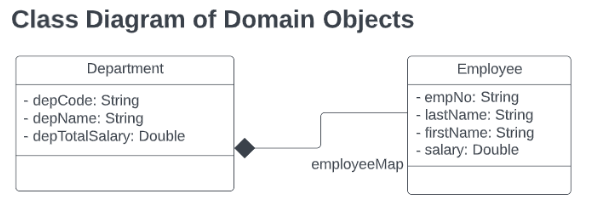
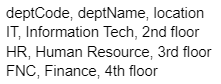
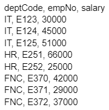
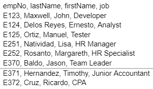
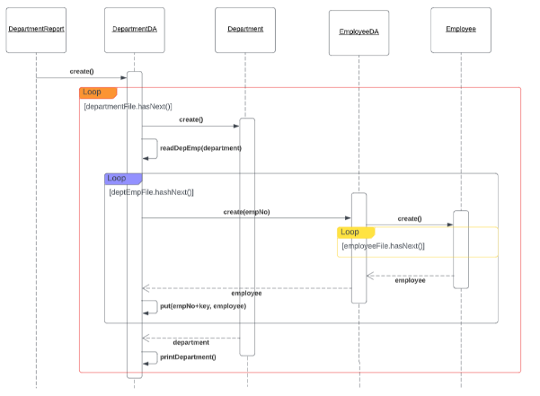
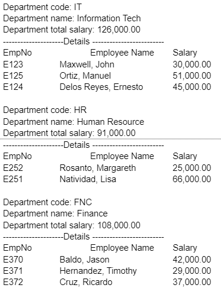

# OOP_LabAssign5

You are required to present a department report that accesses csv files. You must put the data on the domain composition of the objects.

dep.csv contains the following

The deptemp.csv is referenced to get the salary  of the employees per department:

To get the details of the employee you must access the emp.csv:

You need to create objects that will handle the retrieval of the csv files to convert it into objects.  These are EmployeeDA and EmployeeDA objects.  This will be the execution of the sequence:

This will be the sample generated report:

